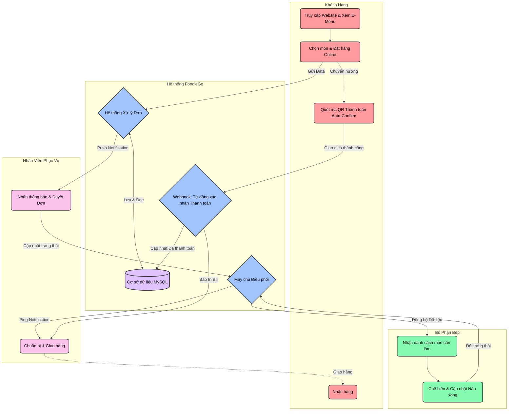
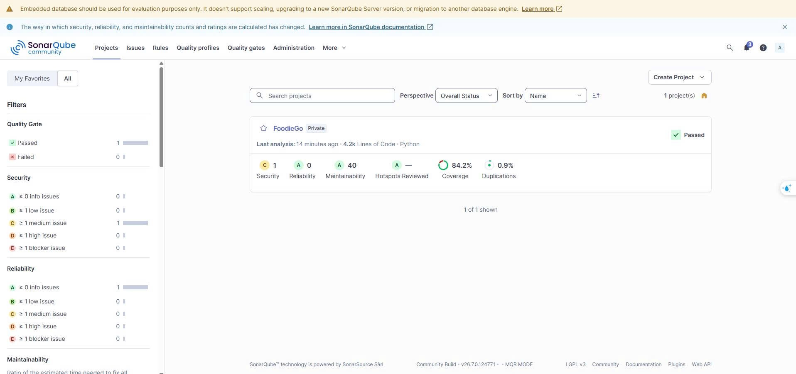

# FoodieGo - Hệ thống Đặt món ăn Điện tử (E-Menu) & Quản lý Nhà hàng

Dự án này bao gồm 2 phần chính:
- **Backend:** Xây dựng bằng Django REST Framework (DRF).
- **Frontend:** Bao gồm ứng dụng `admin` (Dành cho Quản lý) và `emenu` (Dành cho Khách hàng), được xây dựng bằng React/Node.js.

Do Frontend được cấu hình gọi API thông qua một public URL, hệ thống bắt buộc phải sử dụng **ngrok** để forward port của Backend. Dưới đây là hướng dẫn chi tiết cách chạy hệ thống.

---

## ✨ Chức năng nổi bật
- **Admin Dashboard:** Quản lý Người dùng, Đơn hàng, Thực đơn, Khuyến mãi (Vouchers), Kho (Inventory), và Báo cáo Doanh thu theo thời gian thực.
- **Khách hàng E-Menu:** Xem thực đơn trực quan, đặt hàng online, theo dõi trạng thái đơn hàng và thanh toán tiện lợi.
- **Bảo mật & Hiệu suất:** Hệ thống phân quyền chặt chẽ (Role-Based Access Control) với JWT Token, hỗ trợ lọc và phân trang dữ liệu chuẩn RESTful.

---

## 🛠 Yêu cầu hệ thống (Prerequisites)
1. **Python 3.10+**
2. **Node.js (v16+)** & **npm** hoặc **yarn**
3. **Ngrok** (Cài đặt sẵn và đã đăng nhập tài khoản ngrok để không bị giới hạn session).

---

## 🚀 Hướng dẫn Khởi chạy (Dành cho Giảng viên kiểm tra)

Vui lòng mở **3 cửa sổ Terminal** độc lập để chạy đồng thời Backend, Ngrok, và Frontend.

### Bước 1: Khởi chạy Backend (Terminal 1)
Mở cửa sổ Terminal đầu tiên và đi vào thư mục `backend`:
```bash
cd backend

# 1. (Tùy chọn) Kích hoạt môi trường ảo (Virtual Environment)
# Windows:
env\Scripts\activate
# Mac/Linux:
source env/bin/activate

# 2. Cài đặt thư viện
pip install -r requirements.txt

# 3. Chạy server ở cổng 8000
python manage.py runserver 8000
```
*Lưu ý: Không tắt Terminal này.*

### Bước 2: Khởi chạy Ngrok (Terminal 2) - BẮT BUỘC
Để Frontend có thể kết nối với Backend thông qua môi trường mạng mở rộng, dự án sử dụng ngrok để forward cổng 8000 của backend lên public URL.

Mở cửa sổ Terminal thứ 2:
```bash
# Chạy lệnh ngrok để forward port 8000 của backend
ngrok http 8000
```
> **Lưu ý Quan Trọng:** Ngrok sẽ cung cấp một URL dạng `https://<chuỗi-ngẫu-nhiên>.ngrok-free.app`. Bạn bắt buộc phải copy URL này và dán đè vào biến Base URL trong mã nguồn Frontend để ứng dụng có thể gọi đúng API. Cụ thể, hãy sửa URL tại các file sau:
> 
> 1. **Dự án E-Menu:**
>    - Mở file: `frontend/emenu/config.js`
>    - Sửa biến: `const defaultApiBase = "URL_NGROK_CỦA_BẠN";`
> 
> 2. **Dự án Admin:**
>    - Mở file: `frontend/admin/src/environment.jsx`
>    - Sửa biến: `export const API_BASE = "URL_NGROK_CỦA_BẠN";`

### Bước 3: Khởi chạy Frontend (Terminal 3)
Hệ thống Frontend chia làm 2 phân hệ. Bạn có thể chọn chạy 1 trong 2 hoặc chạy cả 2 (cần mở thêm Terminal).

**Chạy trang Admin (Quản trị viên):**
```bash
cd frontend/admin

# Cài đặt thư viện (Chỉ cần chạy lần đầu)
npm install

# Khởi chạy frontend
npm start 
# hoặc: npm run dev
```

**Chạy trang E-menu (Dành cho khách hàng xem thực đơn):**
```bash
cd frontend/emenu

# Cài đặt thư viện (Chỉ cần chạy lần đầu)
npm install

# Khởi chạy frontend
npm start 
# hoặc: npm run dev
```

---

## 📈 Sơ đồ quy trình (Process Diagram)
Dưới đây là sơ đồ luồng nghiệp vụ cơ bản của hệ thống FoodieGo:



---

## 📖 Tài liệu API (API Documentation)
Toàn bộ API được thiết kế theo chuẩn RESTful, trả về dữ liệu dạng JSON và sử dụng JWT (JSON Web Token) để xác thực.

Hệ thống FoodieGo cung cấp hơn 30+ endpoints hỗ trợ đầy đủ các tính năng cho Khách hàng, Nhân viên và Quản lý.

👉 **[Xem chi tiết toàn bộ Tài liệu API tại đây (API_DOCS.md)](API_DOCS.md)**

Trong tài liệu trên, bạn sẽ tìm thấy cấu trúc JSON (Body/Params), Phương thức (GET/POST/PUT/PATCH), Endpoint và Phân quyền (Role) chi tiết của:
- Auth & Users (Đăng nhập, đăng ký, JWT)
- Foods & Categories (Quản lý món ăn)
- Orders (Tạo đơn, duyệt đơn)
- Tables (Quản lý và lấy QR Bàn)
- Payments & Webhook (Thanh toán tự động)
- Staff Calls (Gọi nhân viên)
- Reports (Báo cáo doanh thu)

---

## 🛡 Quản lý Chất lượng Mã nguồn (SonarQube)
Dự án được quét phân tích tĩnh (Static Analysis) bằng SonarCloud/SonarQube thông qua CI/CD GitHub Actions nhằm đảm bảo không có lỗ hổng bảo mật và tuân thủ các chuẩn mực Clean Code.



---

## 📊 Hướng dẫn kiểm tra Độ phủ Code (Test Coverage)

Dự án đã được viết bộ Unit Test rất kỹ lưỡng để đảm bảo độ tin cậy của các API nghiệp vụ. Độ phủ (Coverage) đạt mức **> 80%**.

Để Giảng viên tự kiểm chứng, vui lòng vào thư mục `backend` và chạy các lệnh sau:

```bash
cd backend

# Chạy toàn bộ các test case kèm bộ đo lường coverage
coverage run --source='apps' manage.py test

# Xuất báo cáo tỷ lệ % bao phủ trên Terminal
coverage report -m
```
*Lưu ý: Bộ test sử dụng `.coveragerc` để tập trung đánh giá chất lượng của các khối code lõi (Core Models, Serializers, và một số Views chính).*

Để xem giao diện HTML trực quan màu sắc từng dòng code đã test:
```bash
coverage html
# Sau đó mở file backend/htmlcov/index.html bằng trình duyệt web.
```

---
*Cảm ơn Thầy/Cô đã dành thời gian kiểm tra đồ án! <!-- Trigger pipeline -->*
