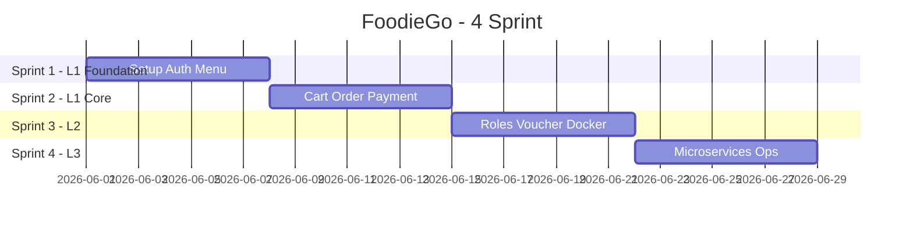
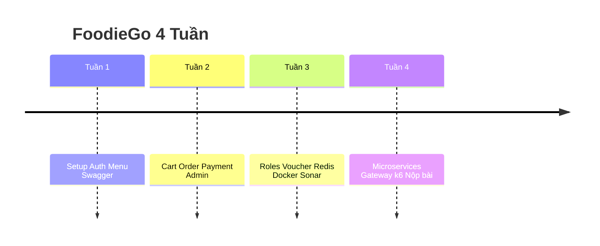

# FoodieGo — MASTER TASKS & FEATURE BRANCHES

**Thời gian:** 4 tuần = 4 Sprint (1 tuần/Sprint)  
**Team gợi ý:** 3–4 người  
**Mục tiêu:** Level 1 + Level 2 + Level 3 + SPQM trong 4 Sprint

> **File này là nguồn duy nhất** để tạo task trên GitHub Issues / Jira / Trello và đặt tên nhánh Git.

---

## MỤC LỤC

1. [Quy ước đặt tên nhánh & commit](#1-quy-ước-đặt-tên-nhánh--commit)
2. [Tổng quan 4 Sprint](#2-tổng-quan-4-sprint)
3. [Bảng tra cứu nhanh — Feature → Branch](#3-bảng-tra-cứu-nhanh--feature--branch)
4. [Sprint 1 — Nền tảng & Menu](#4-sprint-1--nền-tảng--menu)
5. [Sprint 2 — Giỏ hàng & Đơn hàng](#5-sprint-2--giỏ-hàng--đơn-hàng)
6. [Sprint 3 — Mở rộng & Chất lượng](#6-sprint-3--mở-rộng--chất-lượng)
7. [Sprint 4 — Microservices & Nộp đồ án](#7-sprint-4--microservices--nộp-đồ-án)
8. [Chi tiết từng Feature (đầy đủ)](#8-chi-tiết-từng-feature-đầy-đủ)
9. [SPQM Tasks (xuyên suốt 4 Sprint)](#9-spqm-tasks-xuyên-suốt-4-sprint)
10. [Timeline & Milestone](#10-timeline--milestone)
11. [Checklist nộp bài](#11-checklist-nộp-bài)

---

## 1. QUY ƯỚC ĐẶT TÊN NHÁNH & COMMIT

### 1.1 Git Flow

```
main          ← production, chỉ merge từ develop (release)
develop       ← integration, merge tất cả feature
feature/*     ← mỗi feature 1 nhánh
bugfix/*      ← sửa lỗi trên develop
hotfix/*      ← sửa khẩn trên main (hiếm khi dùng)
```

### 1.2 Quy tắc đặt tên nhánh Feature

```
feature/FOOD-{MãFeature}-{mô-tả-ngắn-kebab-case}
```

| Thành phần | Quy tắc | Ví dụ |
|------------|---------|-------|
| Prefix | Luôn `feature/` | `feature/` |
| Mã | `FOOD-001` đến `FOOD-030` | `FOOD-005` |
| Mô tả | Tiếng Anh, kebab-case, ≤5 từ | `jwt-auth`, `cart-api` |

**Ví dụ đúng:**
- `feature/FOOD-001-project-setup`
- `feature/FOOD-008-cart-api`
- `feature/FOOD-019-redis-cache`

**Ví dụ sai:**
- `feature/cart` (thiếu mã)
- `feature/FOOD-008_Cart_API` (snake_case, viết hoa)

### 1.3 Quy tắc Commit (Conventional Commits)

```
{type}({scope}): {mô tả ngắn}

[optional body]
```

| Type | Dùng khi |
|------|----------|
| `feat` | Tính năng mới |
| `fix` | Sửa bug |
| `test` | Thêm/sửa test |
| `docs` | Tài liệu |
| `refactor` | Refactor không đổi behavior |
| `ci` | GitHub Actions, Docker CI |
| `chore` | Config, dependency |

**Ví dụ:**
```
feat(auth): add JWT login and register endpoints
test(cart): add unit tests for add-to-cart service
ci(github): add pytest coverage gate at 70%
```

### 1.4 Quy trình làm 1 Feature

```
1. Checkout develop → pull latest
2. git checkout -b feature/FOOD-XXX-ten-feature
3. Làm task BE → FE → Test (theo checklist feature)
4. Commit theo convention
5. Push → tạo PR vào develop
6. CI pass + 1 reviewer approve → merge
7. Xóa nhánh feature (optional)
```

---

## 2. TỔNG QUAN 4 SPRINT

| Sprint | Tuần | Theme | Level | Mục tiêu chính | SP |
|--------|------|-------|-------|----------------|-----|
| **S1** | 1 | Nền tảng & Menu | L1 | Setup, Auth, Category, Food, Menu UI | 21 |
| **S2** | 2 | Core Business | L1 | Cart, Order, Payment, Tracking, Admin User | 26 |
| **S3** | 3 | Mở rộng & Quality | L2 | Roles, Voucher, Review, Notify, Redis, Docker, Sonar | 24 |
| **S4** | 4 | Microservices & Delivery | L3 | Tách 3 services, Gateway, Monitoring, k6, SPQM | 22 |
| | | | | **Tổng** | **93 SP** |

### Phân bổ Level trong 4 tuần



### SMART-Q Goal theo Sprint

| Sprint | Goal |
|--------|------|
| S1 | Repo chạy được local; login/register OK; menu hiển thị ≥10 món; Swagger có auth + food |
| S2 | Flow đặt hàng end-to-end; coverage ≥70%; CI pass |
| S3 | 4 roles hoạt động; Docker 1 lệnh; coverage ≥80%; Sonar Quality Gate pass |
| S4 | 3 microservices + Gateway deploy; k6 P95 <500ms; báo cáo SPQM + demo video |

---

## 3. BẢNG TRA CỨU NHANH — FEATURE → BRANCH

| Mã | Tên Feature | Branch | Sprint |
|----|-------------|--------|--------|
| FOOD-001 | Project Setup & Git Flow | `feature/FOOD-001-project-setup` | S1 |
| FOOD-002 | GitHub Actions CI | `feature/FOOD-002-github-ci` | S1 |
| FOOD-003 | JWT Authentication | `feature/FOOD-003-jwt-auth` | S1 |
| FOOD-004 | User Registration & Profile | `feature/FOOD-004-user-register` | S1 |
| FOOD-005 | Category CRUD | `feature/FOOD-005-category-crud` | S1 |
| FOOD-006 | Food CRUD | `feature/FOOD-006-food-crud` | S1 |
| FOOD-007 | Food Search & Filter | `feature/FOOD-007-food-search` | S1 |
| FOOD-008 | Menu Page (Public) | `feature/FOOD-008-menu-page` | S1 |
| FOOD-009 | Swagger API Docs | `feature/FOOD-009-swagger-docs` | S1 |
| FOOD-010 | Cart API | `feature/FOOD-010-cart-api` | S2 |
| FOOD-011 | Cart UI | `feature/FOOD-011-cart-ui` | S2 |
| FOOD-012 | Order Creation | `feature/FOOD-012-order-create` | S2 |
| FOOD-013 | Payment (COD Mock) | `feature/FOOD-013-payment-cod` | S2 |
| FOOD-014 | Checkout Page | `feature/FOOD-014-checkout-page` | S2 |
| FOOD-015 | Order Tracking | `feature/FOOD-015-order-tracking` | S2 |
| FOOD-016 | Admin User Management | `feature/FOOD-016-admin-users` | S2 |
| FOOD-017 | Admin Dashboard Layout | `feature/FOOD-017-admin-layout` | S2 |
| FOOD-018 | Role-Based Access Control | `feature/FOOD-018-rbac-roles` | S3 |
| FOOD-019 | Redis Cache | `feature/FOOD-019-redis-cache` | S3 |
| FOOD-020 | Voucher Management | `feature/FOOD-020-voucher-mgmt` | S3 |
| FOOD-021 | Apply Voucher Checkout | `feature/FOOD-021-voucher-checkout` | S3 |
| FOOD-022 | Rating & Review | `feature/FOOD-022-rating-review` | S3 |
| FOOD-023 | Notification System | `feature/FOOD-023-notification` | S3 |
| FOOD-024 | Celery Background Jobs | `feature/FOOD-024-celery-jobs` | S3 |
| FOOD-025 | Revenue Report | `feature/FOOD-025-revenue-report` | S3 |
| FOOD-026 | Docker Compose | `feature/FOOD-026-docker-compose` | S3 |
| FOOD-027 | SonarQube Quality Gate | `feature/FOOD-027-sonarqube` | S3 |
| FOOD-028 | User Microservice | `feature/FOOD-028-user-service` | S4 |
| FOOD-029 | Food Microservice | `feature/FOOD-029-food-service` | S4 |
| FOOD-030 | Order Microservice | `feature/FOOD-030-order-service` | S4 |
| FOOD-031 | API Gateway | `feature/FOOD-031-api-gateway` | S4 |
| FOOD-032 | Prometheus & Grafana | `feature/FOOD-032-monitoring` | S4 |
| FOOD-033 | k6 Load Testing | `feature/FOOD-033-k6-loadtest` | S4 |

---

## 4. SPRINT 1 — NỀN TẢNG & MENU

**Mục tiêu Sprint:** Hệ thống chạy local; đăng ký/đăng nhập; admin quản lý danh mục & món; khách xem menu + tìm kiếm.

**Demo cuối Sprint:** Login → Admin thêm category/food → Guest xem menu + search.

### Task List Sprint 1

| Task ID | Feature | Branch | Mô tả ngắn | SP | Owner gợi ý |
|---------|---------|--------|------------|-----|-------------|
| S1-T01 | FOOD-001 | `feature/FOOD-001-project-setup` | Khởi tạo repo, Django, React, PostgreSQL | 3 | DevOps/BE |
| S1-T02 | FOOD-002 | `feature/FOOD-002-github-ci` | CI: lint + test skeleton | 2 | DevOps |
| S1-T03 | FOOD-003 | `feature/FOOD-003-jwt-auth` | JWT login, refresh token | 5 | BE |
| S1-T04 | FOOD-004 | `feature/FOOD-004-user-register` | Register API + Login/Register UI | 3 | BE+FE |
| S1-T05 | FOOD-005 | `feature/FOOD-005-category-crud` | CRUD Category API + Admin UI | 3 | BE+FE |
| S1-T06 | FOOD-006 | `feature/FOOD-006-food-crud` | CRUD Food API + Admin UI | 3 | BE+FE |
| S1-T07 | FOOD-007 | `feature/FOOD-007-food-search` | Search/filter API | 2 | BE |
| S1-T08 | FOOD-008 | `feature/FOOD-008-menu-page` | Trang Menu public + FoodCard | 3 | FE |
| S1-T09 | FOOD-009 | `feature/FOOD-009-swagger-docs` | drf-spectacular Swagger UI | 2 | BE |

**Tổng Sprint 1:** 26 SP (có thể gộp nếu team nhỏ)

---

## 5. SPRINT 2 — GIỎ HÀNG & ĐƠN HÀNG

**Mục tiêu Sprint:** Flow mua hàng hoàn chỉnh; admin quản lý user; coverage ≥70%.

**Demo cuối Sprint:** Customer thêm giỏ → checkout COD → xem trạng thái đơn.

### Task List Sprint 2

| Task ID | Feature | Branch | Mô tả ngắn | SP | Owner gợi ý |
|---------|---------|--------|------------|-----|-------------|
| S2-T01 | FOOD-010 | `feature/FOOD-010-cart-api` | Cart model + add/update/delete/clear API | 5 | BE |
| S2-T02 | FOOD-011 | `feature/FOOD-011-cart-ui` | Trang giỏ hàng + CartContext | 3 | FE |
| S2-T03 | FOOD-012 | `feature/FOOD-012-order-create` | Tạo đơn từ giỏ, trừ stock, transaction | 8 | BE |
| S2-T04 | FOOD-013 | `feature/FOOD-013-payment-cod` | Payment mock COD | 3 | BE |
| S2-T05 | FOOD-014 | `feature/FOOD-014-checkout-page` | Trang checkout (địa chỉ, payment) | 5 | FE |
| S2-T06 | FOOD-015 | `feature/FOOD-015-order-tracking` | Order list + status timeline UI/API | 5 | BE+FE |
| S2-T07 | FOOD-016 | `feature/FOOD-016-admin-users` | Admin CRUD user | 3 | BE+FE |
| S2-T08 | FOOD-017 | `feature/FOOD-017-admin-layout` | Admin sidebar, protected routes | 2 | FE |
| S2-T09 | — | `test/FOOD-coverage-70` | Bổ sung pytest đạt ≥70% | 3 | QA+BE |

**Tổng Sprint 2:** 37 SP → ưu tiên Must Have trước (T01–T06)

---

## 6. SPRINT 3 — MỞ RỘNG & CHẤT LƯỢNG

**Mục tiêu Sprint:** Level 2 đầy đủ; Docker Compose; Sonar; coverage ≥80%.

**Demo cuối Sprint:** Voucher giảm giá; đánh giá món; thông báo Celery; `docker compose up`.

### Task List Sprint 3

| Task ID | Feature | Branch | Mô tả ngắn | SP | Owner gợi ý |
|---------|---------|--------|------------|-----|-------------|
| S3-T01 | FOOD-018 | `feature/FOOD-018-rbac-roles` | 4 roles + permissions | 5 | BE |
| S3-T02 | FOOD-019 | `feature/FOOD-019-redis-cache` | Cache menu, category, food detail | 3 | BE |
| S3-T03 | FOOD-020 | `feature/FOOD-020-voucher-mgmt` | Admin CRUD voucher | 3 | BE+FE |
| S3-T04 | FOOD-021 | `feature/FOOD-021-voucher-checkout` | Validate & apply voucher khi đặt hàng | 3 | BE+FE |
| S3-T05 | FOOD-022 | `feature/FOOD-022-rating-review` | Review sau delivered + avg_rating | 5 | BE+FE |
| S3-T06 | FOOD-023 | `feature/FOOD-023-notification` | Notification model + list UI | 3 | BE+FE |
| S3-T07 | FOOD-024 | `feature/FOOD-024-celery-jobs` | Celery: order confirm, status notify | 5 | BE |
| S3-T08 | FOOD-025 | `feature/FOOD-025-revenue-report` | API + chart doanh thu theo ngày | 3 | BE+FE |
| S3-T09 | FOOD-026 | `feature/FOOD-026-docker-compose` | Docker full stack | 3 | DevOps |
| S3-T10 | FOOD-027 | `feature/FOOD-027-sonarqube` | Sonar scan + Quality Gate CI | 3 | DevOps+QA |

**Tổng Sprint 3:** 36 SP

---

## 7. SPRINT 4 — MICROSERVICES & NỘP ĐỒ ÁN

**Mục tiêu Sprint:** Tách 3 services; API Gateway; monitoring; k6; hoàn thiện báo cáo SPQM.

**Demo cuối Sprint:** Full demo 15 phút + nộp source + báo cáo.

### Task List Sprint 4

| Task ID | Feature | Branch | Mô tả ngắn | SP | Owner gợi ý |
|---------|---------|--------|------------|-----|-------------|
| S4-T01 | FOOD-028 | `feature/FOOD-028-user-service` | Tách User Service :8001 | 5 | BE |
| S4-T02 | FOOD-029 | `feature/FOOD-029-food-service` | Tách Food Service :8002 | 5 | BE |
| S4-T03 | FOOD-030 | `feature/FOOD-030-order-service` | Tách Order Service :8003 | 8 | BE |
| S4-T04 | FOOD-031 | `feature/FOOD-031-api-gateway` | Nginx/Kong route tới services | 5 | DevOps |
| S4-T05 | FOOD-032 | `feature/FOOD-032-monitoring` | Prometheus + Grafana dashboard | 3 | DevOps |
| S4-T06 | FOOD-033 | `feature/FOOD-033-k6-loadtest` | k6 script + báo cáo KPI | 3 | QA |
| S4-T07 | SPQM | `docs/FOOD-spqm-final-report` | Hoàn thiện SPQM, CMMI, ODA | 3 | PM/All |
| S4-T08 | Demo | `chore/FOOD-final-polish` | Seed data, fix bug, video demo | 3 | All |

**Tổng Sprint 4:** 35 SP

---

## 8. CHI TIẾT TỪNG FEATURE (ĐẦY ĐỦ)

> Copy từng block dưới đây làm **GitHub Issue** hoặc **task card**.

---

### FOOD-001 — Project Setup & Git Flow

| | |
|---|---|
| **Branch** | `feature/FOOD-001-project-setup` |
| **Sprint** | S1 |
| **SP** | 3 |
| **Phụ thuộc** | Không |
| **Roles** | DevOps, Backend, Frontend |

**Mô tả:**  
Khởi tạo monorepo FoodieGo với backend Django + DRF, frontend React, PostgreSQL. Thiết lập Git Flow (`main`, `develop`), PR template, commit convention.

**Acceptance Criteria:**
- [ ] Repo GitHub có nhánh `main` và `develop`
- [ ] `backend/` — Django project `config`, app structure sẵn sàng
- [ ] `frontend/` — React (Vite) + ESLint + Material UI
- [ ] PostgreSQL kết nối qua `.env`
- [ ] README hướng dẫn chạy local (BE + FE)
- [ ] PR template + CONTRIBUTING.md

**Tasks chi tiết:**

| # | Loại | Task | File/Path gợi ý |
|---|------|------|-----------------|
| 1 | BE | `django-admin startproject config` | `backend/config/` |
| 2 | BE | Cài DRF, SimpleJWT, django-cors-headers, psycopg2 | `backend/requirements/base.txt` |
| 3 | FE | `npm create vite@latest frontend -- --template react` | `frontend/` |
| 4 | FE | Cài MUI, React Router, Axios | `frontend/package.json` |
| 5 | DevOps | Tạo `.env.example`, `.gitignore` | root |
| 6 | DevOps | PR template | `.github/pull_request_template.md` |

**Commit mẫu:** `chore(setup): initialize django and react monorepo`

---

### FOOD-002 — GitHub Actions CI

| | |
|---|---|
| **Branch** | `feature/FOOD-002-github-ci` |
| **Sprint** | S1 |
| **SP** | 2 |
| **Phụ thuộc** | FOOD-001 |

**Mô tả:**  
Pipeline CI chạy khi push/PR: backend pytest, frontend eslint + build.

**Acceptance Criteria:**
- [ ] Workflow `.github/workflows/ci.yml` chạy trên PR
- [ ] Job backend: migrate + pytest
- [ ] Job frontend: `npm run lint` + `npm run build`
- [ ] Badge CI trong README (optional)

**Tasks chi tiết:**

| # | Loại | Task |
|---|------|------|
| 1 | CI | Tạo workflow với postgres service |
| 2 | CI | Cache pip và npm |
| 3 | CI | Fail nếu lint error |

**Commit mẫu:** `ci(github): add backend test and frontend lint workflow`

---

### FOOD-003 — JWT Authentication

| | |
|---|---|
| **Branch** | `feature/FOOD-003-jwt-auth` |
| **Sprint** | S1 |
| **SP** | 5 |
| **Phụ thuộc** | FOOD-001 |

**Mô tả:**  
Custom User model với role field. API login trả access + refresh token. Middleware xác thực JWT cho protected routes.

**Acceptance Criteria:**
- [ ] `POST /api/v1/auth/login/` → 200 + tokens
- [ ] `POST /api/v1/auth/refresh/` → access token mới
- [ ] Token hết hạn → 401
- [ ] Pytest: login success, login fail, refresh token

**API:**

```
POST /api/v1/auth/login/
Request:  { "email", "password" }
Response: { "access", "refresh", "user": { "id", "email", "role", "full_name" } }
Status:   200 OK | 401 Unauthorized
```

**Tasks chi tiết:**

| # | Loại | Task | File gợi ý |
|---|------|------|-------------|
| 1 | BE | CustomUser model (email login) | `apps/users/models.py` |
| 2 | BE | SimpleJWT config | `config/settings/base.py` |
| 3 | BE | LoginView, RefreshView | `apps/users/views.py` |
| 4 | BE | UserSerializer | `apps/users/serializers.py` |
| 5 | TEST | test_auth_login.py | `apps/users/tests/` |

**Commit mẫu:** `feat(auth): implement JWT login and refresh endpoints`

---

### FOOD-004 — User Registration & Profile

| | |
|---|---|
| **Branch** | `feature/FOOD-004-user-register` |
| **Sprint** | S1 |
| **SP** | 3 |
| **Phụ thuộc** | FOOD-003 |

**Mô tả:**  
Khách đăng ký tài khoản. Trang Login/Register React. AuthContext lưu token.

**Acceptance Criteria:**
- [ ] `POST /api/v1/auth/register/` → 201
- [ ] Email trùng → 409
- [ ] FE: form validation (email, password ≥8 ký tự)
- [ ] Sau login redirect về `/menu`
- [ ] Logout xóa token

**API:**

```
POST /api/v1/auth/register/
Request:  { "email", "password", "full_name", "phone" }
Response: { "id", "email", "full_name", "role": "customer" }
Status:   201 | 400 | 409
```

**Tasks chi tiết:**

| # | Loại | Task | File gợi ý |
|---|------|------|-------------|
| 1 | BE | RegisterView + validate password | `apps/users/views.py` |
| 2 | FE | Trang Login, Register | `pages/public/Login.jsx` |
| 3 | FE | AuthContext + axios interceptor | `contexts/AuthContext.jsx` |
| 4 | FE | ProtectedRoute component | `routes/ProtectedRoute.jsx` |
| 5 | TEST | test_register.py | `apps/users/tests/` |

---

### FOOD-005 — Category CRUD

| | |
|---|---|
| **Branch** | `feature/FOOD-005-category-crud` |
| **Sprint** | S1 |
| **SP** | 3 |
| **Phụ thuộc** | FOOD-003 |

**Mô tả:**  
Admin/Manager quản lý danh mục món ăn (Pizza, Burger, Drink...).

**Acceptance Criteria:**
- [ ] CRUD API `/api/v1/categories/`
- [ ] GET public (không cần auth)
- [ ] POST/PUT/DELETE cần Admin hoặc Restaurant Manager
- [ ] Admin UI: bảng category + form thêm/sửa

**API:**

```
GET    /api/v1/categories/          → 200 list
POST   /api/v1/categories/          → 201 { name, description, is_active }
GET    /api/v1/categories/{id}/     → 200
PATCH  /api/v1/categories/{id}/     → 200
DELETE /api/v1/categories/{id}/     → 204
```

**Tasks chi tiết:**

| # | Loại | Task |
|---|------|------|
| 1 | BE | Model Category | `apps/foods/models.py` |
| 2 | BE | CategoryViewSet + permissions | `apps/foods/views.py` |
| 3 | FE | Admin page ManageCategories | `pages/admin/Categories.jsx` |
| 4 | TEST | test_category_crud.py | |

---

### FOOD-006 — Food CRUD

| | |
|---|---|
| **Branch** | `feature/FOOD-006-food-crud` |
| **Sprint** | S1 |
| **SP** | 3 |
| **Phụ thuộc** | FOOD-005 |

**Mô tả:**  
Quản lý món ăn: tên, giá, mô tả, ảnh URL, stock, category, trạng thái available.

**Acceptance Criteria:**
- [ ] CRUD `/api/v1/foods/`
- [ ] Field: name, description, price, image_url, stock, category_id, is_available
- [ ] Admin UI upload/link ảnh
- [ ] Validation: price ≥ 0, stock ≥ 0

**API:**

```
POST /api/v1/foods/
{
  "name": "Beef Burger",
  "description": "Burger bò 200g",
  "price": "85000.00",
  "category_id": "uuid",
  "stock": 50,
  "image_url": "https://...",
  "is_available": true
}
→ 201 Created
```

**Tasks chi tiết:**

| # | Loại | Task |
|---|------|------|
| 1 | BE | Model Food + FK Category | `apps/foods/models.py` |
| 2 | BE | FoodSerializer (nested category) | `apps/foods/serializers.py` |
| 3 | BE | FoodViewSet | `apps/foods/views.py` |
| 4 | FE | Admin ManageFoods (table + dialog form) | `pages/admin/Foods.jsx` |
| 5 | TEST | test_food_crud.py | |

---

### FOOD-007 — Food Search & Filter

| | |
|---|---|
| **Branch** | `feature/FOOD-007-food-search` |
| **Sprint** | S1 |
| **SP** | 2 |
| **Phụ thuộc** | FOOD-006 |

**Mô tả:**  
Tìm kiếm món theo tên, lọc theo category, phân trang.

**Acceptance Criteria:**
- [ ] `GET /api/v1/foods/?search=burger`
- [ ] `GET /api/v1/foods/?category={uuid}&page=1&page_size=12`
- [ ] Chỉ trả món `is_available=true` (public)
- [ ] Response pagination: count, next, previous, results

**Tasks chi tiết:**

| # | Loại | Task |
|---|------|------|
| 1 | BE | django-filter SearchFilter | `apps/foods/filters.py` |
| 2 | BE | Pagination config | `config/settings/base.py` |
| 3 | FE | SearchBar component debounce 300ms | `components/food/SearchBar.jsx` |
| 4 | TEST | test_food_search.py | |

---

### FOOD-008 — Menu Page (Public)

| | |
|---|---|
| **Branch** | `feature/FOOD-008-menu-page` |
| **Sprint** | S1 |
| **SP** | 3 |
| **Phụ thuộc** | FOOD-007 |

**Mô tả:**  
Trang menu công khai: hiển thị món theo category tab, FoodCard, link chi tiết món.

**Acceptance Criteria:**
- [ ] Route `/menu` không cần đăng nhập
- [ ] Tab/filter theo category
- [ ] FoodCard: ảnh, tên, giá, rating (nếu có)
- [ ] Route `/foods/:id` — trang chi tiết món
- [ ] Responsive mobile

**Tasks chi tiết:**

| # | Loại | Task | File gợi ý |
|---|------|------|-------------|
| 1 | FE | Page Menu | `pages/public/Menu.jsx` |
| 2 | FE | FoodCard, FoodList | `components/food/` |
| 3 | FE | Page FoodDetail | `pages/public/FoodDetail.jsx` |
| 4 | FE | foodApi.js | `api/foodApi.js` |
| 5 | FE | Header với Login/Cart icon | `components/layout/Header.jsx` |

---

### FOOD-009 — Swagger API Docs

| | |
|---|---|
| **Branch** | `feature/FOOD-009-swagger-docs` |
| **Sprint** | S1 |
| **SP** | 2 |
| **Phụ thuộc** | FOOD-003, FOOD-006 |

**Mô tả:**  
Tài liệu API tự động bằng drf-spectacular.

**Acceptance Criteria:**
- [ ] Swagger UI tại `/api/docs/`
- [ ] ReDoc tại `/api/redoc/`
- [ ] Mô tả schema auth, categories, foods
- [ ] Export OpenAPI JSON

---

### FOOD-010 — Cart API

| | |
|---|---|
| **Branch** | `feature/FOOD-010-cart-api` |
| **Sprint** | S2 |
| **SP** | 5 |
| **Phụ thuộc** | FOOD-003, FOOD-006 |

**Mô tả:**  
Mỗi user 1 giỏ hàng. Thêm/sửa/xóa món, tính subtotal.

**Acceptance Criteria:**
- [ ] Auto tạo cart khi user register hoặc lần đầu add
- [ ] `POST /cart/items/` — thêm hoặc tăng quantity nếu đã có
- [ ] `PATCH /cart/items/{id}/` — đổi quantity
- [ ] `DELETE /cart/items/{id}/`
- [ ] `POST /cart/clear/`
- [ ] Validate: quantity > 0, food available, stock đủ

**API:**

```
GET /api/v1/cart/
→ 200 {
  "id": "uuid",
  "items": [{ "id", "food": {...}, "quantity", "subtotal" }],
  "total": "170000.00"
}

POST /api/v1/cart/items/
{ "food_id": "uuid", "quantity": 2 }
→ 201
```

**Tasks chi tiết:**

| # | Loại | Task |
|---|------|------|
| 1 | BE | Models Cart, CartItem | `apps/cart/models.py` |
| 2 | BE | CartService: add, update, remove | `apps/cart/services.py` |
| 3 | BE | CartViewSet | `apps/cart/views.py` |
| 4 | TEST | test_cart_operations.py | |

---

### FOOD-011 — Cart UI

| | |
|---|---|
| **Branch** | `feature/FOOD-011-cart-ui` |
| **Sprint** | S2 |
| **SP** | 3 |
| **Phụ thuộc** | FOOD-010, FOOD-008 |

**Mô tả:**  
Trang giỏ hàng, nút +/- quantity, xóa món, tổng tiền, nút "Thanh toán".

**Acceptance Criteria:**
- [ ] Route `/cart` — yêu cầu login
- [ ] CartContext sync với API
- [ ] Badge số lượng trên icon giỏ ở Header
- [ ] Empty state khi giỏ trống

**Tasks chi tiết:**

| # | Loại | Task |
|---|------|------|
| 1 | FE | CartContext | `contexts/CartContext.jsx` |
| 2 | FE | Page Cart | `pages/customer/Cart.jsx` |
| 3 | FE | CartItem, CartSummary | `components/cart/` |
| 4 | FE | Nút "Add to cart" trên FoodCard | |

---

### FOOD-012 — Order Creation

| | |
|---|---|
| **Branch** | `feature/FOOD-012-order-create` |
| **Sprint** | S2 |
| **SP** | 8 |
| **Phụ thuộc** | FOOD-010 |

**Mô tả:**  
Tạo đơn hàng từ giỏ: transaction atomic, trừ stock, tạo order_items, xóa giỏ.

**Acceptance Criteria:**
- [ ] `POST /api/v1/orders/` từ cart hiện tại
- [ ] Input: delivery_address, payment_method
- [ ] Status ban đầu: `pending`
- [ ] Rollback nếu hết stock
- [ ] Giỏ hàng cleared sau khi tạo đơn thành công
- [ ] OrderItem lưu unit_price tại thời điểm đặt (snapshot giá)

**API:**

```
POST /api/v1/orders/
{
  "delivery_address": "123 Nguyen Van Linh, Q7, HCM",
  "payment_method": "cod"
}
→ 201 {
  "id", "status": "pending", "subtotal", "discount", "total", "items": [...]
}
```

**Tasks chi tiết:**

| # | Loại | Task |
|---|------|------|
| 1 | BE | Models Order, OrderItem | `apps/orders/models.py` |
| 2 | BE | create_order_from_cart service | `apps/orders/services.py` |
| 3 | BE | OrderCreateView | `apps/orders/views.py` |
| 4 | BE | select_for_update tránh race condition stock | |
| 5 | TEST | test_create_order.py, test_insufficient_stock | |

---

### FOOD-013 — Payment (COD Mock)

| | |
|---|---|
| **Branch** | `feature/FOOD-013-payment-cod` |
| **Sprint** | S2 |
| **SP** | 3 |
| **Phụ thuộc** | FOOD-012 |

**Mô tả:**  
Mock thanh toán COD và "online" (fake gateway). Không tích hợp VNPay thật.

**Acceptance Criteria:**
- [ ] Model Payment linked 1-1 Order
- [ ] COD: status `paid` ngay khi tạo đơn
- [ ] Online mock: `POST /payments/{order_id}/confirm/` → paid
- [ ] `GET /payments/{order_id}/` xem trạng thái

---

### FOOD-014 — Checkout Page

| | |
|---|---|
| **Branch** | `feature/FOOD-014-checkout-page` |
| **Sprint** | S2 |
| **SP** | 5 |
| **Phụ thuộc** | FOOD-011, FOOD-012 |

**Mô tả:**  
Trang checkout: xác nhận giỏ, nhập địa chỉ, chọn payment method, đặt hàng.

**Acceptance Criteria:**
- [ ] Route `/checkout`
- [ ] Form validation địa chỉ (required, min length)
- [ ] Radio: COD / Online (mock)
- [ ] Loading state khi submit
- [ ] Redirect `/orders/{id}` sau thành công
- [ ] Toast error nếu fail

---

### FOOD-015 — Order Tracking

| | |
|---|---|
| **Branch** | `feature/FOOD-015-order-tracking` |
| **Sprint** | S2 |
| **SP** | 5 |
| **Phụ thuộc** | FOOD-012 |

**Mô tả:**  
Khách xem danh sách đơn và chi tiết trạng thái. Timeline: pending → confirmed → preparing → delivering → delivered.

**Acceptance Criteria:**
- [ ] `GET /api/v1/orders/` — list đơn của user
- [ ] `GET /api/v1/orders/{id}/` — chi tiết + items
- [ ] FE: OrderTimeline component (stepper MUI)
- [ ] Manager có thể `PATCH /orders/{id}/status/`

**Status flow:**

```
pending → confirmed → preparing → delivering → delivered
         ↘ cancelled (từ pending/confirmed)
```

---

### FOOD-016 — Admin User Management

| | |
|---|---|
| **Branch** | `feature/FOOD-016-admin-users` |
| **Sprint** | S2 |
| **SP** | 3 |
| **Phụ thuộc** | FOOD-003 |

**Mô tả:**  
Admin xem/sửa/khóa user, gán role.

**Acceptance Criteria:**
- [ ] `GET/POST/PATCH/DELETE /api/v1/admin/users/` — Admin only
- [ ] Không cho xóa chính mình
- [ ] FE: bảng user + dropdown role

---

### FOOD-017 — Admin Dashboard Layout

| | |
|---|---|
| **Branch** | `feature/FOOD-017-admin-layout` |
| **Sprint** | S2 |
| **SP** | 2 |
| **Phụ thuộc** | FOOD-016 |

**Mô tả:**  
Layout admin: sidebar (Foods, Categories, Orders, Users, Revenue), header, role guard.

**Acceptance Criteria:**
- [ ] Route `/admin/*` — Admin + Restaurant Manager
- [ ] Customer redirect về `/menu` nếu vào `/admin`
- [ ] Sidebar navigation hoạt động

---

### FOOD-018 — Role-Based Access Control (RBAC)

| | |
|---|---|
| **Branch** | `feature/FOOD-018-rbac-roles` |
| **Sprint** | S3 |
| **SP** | 5 |
| **Phụ thuộc** | FOOD-016 |

**Mô tả:**  
4 roles với permission rõ ràng trên từng API.

**Roles & Quyền:**

| Role | Quyền |
|------|-------|
| `customer` | Cart, order own, review own orders |
| `restaurant_manager` | CRUD food/category, view/update orders, revenue |
| `delivery_staff` | View assigned orders, update status → delivering/delivered |
| `admin` | Full access, user mgmt, voucher |

**Acceptance Criteria:**
- [ ] Permission classes: IsAdmin, IsManager, IsDeliveryStaff, IsOwner
- [ ] Test mỗi role bị 403 khi truy cập sai endpoint
- [ ] Seed 4 user demo (1 mỗi role)

---

### FOOD-019 — Redis Cache

| | |
|---|---|
| **Branch** | `feature/FOOD-019-redis-cache` |
| **Sprint** | S3 |
| **SP** | 3 |
| **Phụ thuộc** | FOOD-006 |

**Mô tả:**  
Cache danh sách món, chi tiết món, danh mục. Invalidate khi CRUD.

**Cache keys:**

| Key | TTL |
|-----|-----|
| `categories:all` | 30 phút |
| `foods:list:{page}:{hash}` | 5 phút |
| `foods:detail:{id}` | 10 phút |

**Acceptance Criteria:**
- [ ] django-redis configured
- [ ] Cache hit giảm query DB (log hoặc test)
- [ ] Invalidate on food/category POST/PUT/DELETE

---

### FOOD-020 — Voucher Management

| | |
|---|---|
| **Branch** | `feature/FOOD-020-voucher-mgmt` |
| **Sprint** | S3 |
| **SP** | 3 |
| **Phụ thuộc** | FOOD-018 |

**Mô tả:**  
Admin tạo mã giảm giá: percent hoặc fixed, min_order, max_uses, thời hạn.

**Acceptance Criteria:**
- [ ] CRUD `/api/v1/vouchers/` — Admin only
- [ ] Fields: code, discount_type, discount_value, min_order, max_uses, start_date, end_date
- [ ] Admin UI quản lý voucher

---

### FOOD-021 — Apply Voucher at Checkout

| | |
|---|---|
| **Branch** | `feature/FOOD-021-voucher-checkout` |
| **Sprint** | S3 |
| **SP** | 3 |
| **Phụ thuộc** | FOOD-020, FOOD-012 |

**Mô tả:**  
Khách nhập mã voucher khi checkout. Validate và tính discount.

**Acceptance Criteria:**
- [ ] `POST /api/v1/vouchers/validate/` → `{ valid, discount, message }`
- [ ] Order lưu voucher_id, discount, total = subtotal - discount
- [ ] Reject: hết hạn, hết lượt, đơn < min_order, code sai
- [ ] FE: input voucher + hiển thị số tiền giảm

---

### FOOD-022 — Rating & Review

| | |
|---|---|
| **Branch** | `feature/FOOD-022-rating-review` |
| **Sprint** | S3 |
| **SP** | 5 |
| **Phụ thuộc** | FOOD-015 |

**Mô tả:**  
Sau khi đơn `delivered`, customer đánh giá món 1–5 sao + comment.

**Acceptance Criteria:**
- [ ] `POST /api/v1/reviews/` — chỉ order delivered, 1 review/food/order
- [ ] `GET /api/v1/foods/{id}/reviews/`
- [ ] Cập nhật `food.avg_rating` sau review
- [ ] FE: form review trên OrderDetail
- [ ] Hiển thị rating trên FoodCard

---

### FOOD-023 — Notification System

| | |
|---|---|
| **Branch** | `feature/FOOD-023-notification` |
| **Sprint** | S3 |
| **SP** | 3 |
| **Phụ thuộc** | FOOD-015 |

**Mô tả:**  
In-app notification khi đơn thay đổi trạng thái.

**Acceptance Criteria:**
- [ ] Model Notification (user, title, message, is_read)
- [ ] `GET /api/v1/notifications/`
- [ ] `PATCH /api/v1/notifications/{id}/read/`
- [ ] FE: icon chuông + badge unread + dropdown list

---

### FOOD-024 — Celery Background Jobs

| | |
|---|---|
| **Branch** | `feature/FOOD-024-celery-jobs` |
| **Sprint** | S3 |
| **SP** | 5 |
| **Phụ thuộc** | FOOD-023 |

**Mô tả:**  
Celery worker xử lý notification và email mock bất đồng bộ.

**Tasks:**

| Celery Task | Trigger |
|-------------|---------|
| `send_order_confirmation` | Order created |
| `send_status_update` | Order status changed |
| `calculate_daily_revenue` | Cron 00:00 daily |

**Acceptance Criteria:**
- [ ] Celery + Redis broker configured
- [ ] API trả 201 ngay, notification tạo async ≤5s
- [ ] `docker compose` có service celery-worker

---

### FOOD-025 — Revenue Report

| | |
|---|---|
| **Branch** | `feature/FOOD-025-revenue-report` |
| **Sprint** | S3 |
| **SP** | 3 |
| **Phụ thuộc** | FOOD-018 |

**Mô tả:**  
Manager/Admin xem doanh thu theo khoảng ngày.

**Acceptance Criteria:**
- [ ] `GET /api/v1/reports/revenue/?from=2026-06-01&to=2026-06-18`
- [ ] Response: total_revenue, total_orders, daily breakdown
- [ ] FE: chart (Recharts) + date picker

---

### FOOD-026 — Docker Compose

| | |
|---|---|
| **Branch** | `feature/FOOD-026-docker-compose` |
| **Sprint** | S3 |
| **SP** | 3 |
| **Phụ thuộc** | FOOD-024 |

**Mô tả:**  
Docker hóa full stack: db, redis, backend, celery, frontend.

**Acceptance Criteria:**
- [ ] `docker compose up -d` chạy toàn bộ
- [ ] README cập nhật hướng dẫn Docker
- [ ] Healthcheck postgres
- [ ] `.env.example` đầy đủ

---

### FOOD-027 — SonarQube Quality Gate

| | |
|---|---|
| **Branch** | `feature/FOOD-027-sonarqube` |
| **Sprint** | S3 |
| **SP** | 3 |
| **Phụ thuộc** | FOOD-002 |

**Mô tả:**  
SonarQube scan trong CI. Quality Gate: 0 bugs, 0 vuln, coverage ≥80%.

**Acceptance Criteria:**
- [ ] `sonar-project.properties` configured
- [ ] CI job sonarqube scan
- [ ] Quality Gate pass trước merge main
- [ ] Báo cáo screenshot Sonar dashboard

---

### FOOD-028 — User Microservice

| | |
|---|---|
| **Branch** | `feature/FOOD-028-user-service` |
| **Sprint** | S4 |
| **SP** | 5 |
| **Phụ thuộc** | FOOD-003 |

**Mô tả:**  
Tách app `users` thành service độc lập port 8001, database `user_db`.

**Acceptance Criteria:**
- [ ] Service chạy `:8001`
- [ ] Endpoints: register, login, refresh, user profile
- [ ] Dockerfile riêng
- [ ] JWT secret shared với các service (env)

---

### FOOD-029 — Food Microservice

| | |
|---|---|
| **Branch** | `feature/FOOD-029-food-service` |
| **Sprint** | S4 |
| **SP** | 5 |
| **Phụ thuộc** | FOOD-006 |

**Mô tả:**  
Tách categories + foods → service `:8002`, database `food_db`.

**Acceptance Criteria:**
- [ ] CRUD category, food, search
- [ ] Redis cache trong service
- [ ] Health endpoint `/health/`

---

### FOOD-030 — Order Microservice

| | |
|---|---|
| **Branch** | `feature/FOOD-030-order-service` |
| **Sprint** | S4 |
| **SP** | 8 |
| **Phụ thuộc** | FOOD-028, FOOD-029 |

**Mô tả:**  
Order, cart, payment, voucher → service `:8003`. Gọi User/Food service qua HTTP.

**Acceptance Criteria:**
- [ ] Tạo order: gọi Food service validate stock + price
- [ ] JWT validate qua User service hoặc shared secret
- [ ] Database `order_db` riêng

---

### FOOD-031 — API Gateway

| | |
|---|---|
| **Branch** | `feature/FOOD-031-api-gateway` |
| **Sprint** | S4 |
| **SP** | 5 |
| **Phụ thuộc** | FOOD-028, FOOD-029, FOOD-030 |

**Mô tả:**  
Nginx/Kong route `/api/v1/users/*` → User Service, tương tự food, orders.

**Routing:**

| Path | Service |
|------|---------|
| `/api/v1/auth/*`, `/api/v1/users/*` | User :8001 |
| `/api/v1/categories/*`, `/api/v1/foods/*` | Food :8002 |
| `/api/v1/cart/*`, `/api/v1/orders/*`, `/api/v1/payments/*` | Order :8003 |

**Acceptance Criteria:**
- [ ] Gateway port 8080
- [ ] FE chỉ gọi gateway URL
- [ ] CORS configured tại gateway

---

### FOOD-032 — Prometheus & Grafana

| | |
|---|---|
| **Branch** | `feature/FOOD-032-monitoring` |
| **Sprint** | S4 |
| **SP** | 3 |
| **Phụ thuộc** | FOOD-031 |

**Mô tả:**  
Metrics HTTP request, latency, error rate. Dashboard Grafana.

**Acceptance Criteria:**
- [ ] django-prometheus hoặc middleware custom
- [ ] `/metrics` endpoint mỗi service
- [ ] Grafana dashboard: RPS, P95 latency, error rate
- [ ] Screenshot dashboard trong báo cáo

---

### FOOD-033 — k6 Load Testing

| | |
|---|---|
| **Branch** | `feature/FOOD-033-k6-loadtest` |
| **Sprint** | S4 |
| **SP** | 3 |
| **Phụ thuộc** | FOOD-031 |

**Mô tả:**  
Load test browse menu + login + cart qua API Gateway.

**KPI:**

| Metric | Target |
|--------|--------|
| P95 GET /foods/ | < 500ms |
| P95 POST /orders/ | < 1500ms |
| Error rate | < 1% |
| VUs | 50, duration 5 phút |

**Acceptance Criteria:**
- [ ] Script `tests/load/script.js`
- [ ] Báo cáo HTML k6
- [ ] Screenshot kết quả trong báo cáo

---

## 9. SPQM TASKS (XUYÊN SUỐT 4 SPRINT)

| Task ID | Mô tả | Sprint | Branch/Deliverable |
|---------|-------|--------|-------------------|
| SPQM-01 | Viết SDLC (Scrum) + Product Vision | S1 | `docs/SPQM-REPORT.md` |
| SPQM-02 | Vẽ ETVX cho "Implement Feature" | S1 | trong SPQM report |
| SPQM-03 | Product Backlog (file Excel/Sheet) | S1 | `docs/backlog/Product_Backlog.xlsx` |
| SPQM-04 | Sprint Backlog S1 | S1 | GitHub Projects |
| SPQM-05 | SMART-Q goal S1 | S1 | SPQM report |
| SPQM-06 | Metrics baseline (coverage, CI fail rate) | S2 | `docs/metrics/` |
| SPQM-07 | PDCA vòng 1 (pre-commit / CI improvement) | S2 | SPQM report |
| SPQM-08 | Sprint Retrospective S1, S2 | S2 | `docs/retros/` |
| SPQM-09 | CMMI assessment L1→L3 | S3 | SPQM report |
| SPQM-10 | Metrics trend chart (4 sprint) | S3 | Excel |
| SPQM-11 | Sprint Retrospective S3 | S3 | |
| SPQM-12 | ODA tổng kết + demo video | S4 | PDF + MP4 |

---

## 10. TIMELINE & MILESTONE

| Tuần | Sprint | Milestone | Demo |
|------|--------|-----------|------|
| **1** | S1 | Foundation ready | Login, admin thêm món, xem menu |
| **2** | S2 | **Level 1 done** | Đặt hàng COD, tracking, coverage 70% |
| **3** | S3 | **Level 2 done** | Voucher, review, Docker, Sonar 80% |
| **4** | S4 | **Final delivery** | Microservices, k6, SPQM, nộp bài |



---

## 11. CHECKLIST NỘP BÀI

### Source Code
- [ ] Backend Django (monolith + microservices)
- [ ] Frontend React
- [ ] `docker compose up` chạy được
- [ ] `.github/workflows/ci.yml`
- [ ] README hướng dẫn đầy đủ

### Testing & Quality
- [ ] Coverage report ≥80%
- [ ] SonarQube report + Quality Gate pass
- [ ] k6 load test report

### Tài liệu
- [ ] Báo cáo đồ án PDF
- [ ] SPQM Report PDF
- [ ] Slide thuyết trình
- [ ] API Spec (Swagger export)
- [ ] Demo video 10–15 phút

### SPQM Evidence
- [ ] Product Backlog + Sprint Backlog
- [ ] ETVX diagram
- [ ] PDCA improvement (có số liệu)
- [ ] CMMI assessment
- [ ] Metrics trend 4 sprint
- [ ] 3–5 screenshot PR đã review

---

## PHỤ LỤC — COPY NHANH LỆNH GIT

```bash
# Bắt đầu feature mới
git checkout develop
git pull origin develop
git checkout -b feature/FOOD-010-cart-api

# Làm xong, push PR
git add .
git commit -m "feat(cart): add cart API with add update delete"
git push -u origin feature/FOOD-010-cart-api
# → Tạo PR: feature/FOOD-010-cart-api → develop

# Sau khi merge, cập nhật local
git checkout develop
git pull origin develop
```

---

## PHỤ LỤC — GỢI Ý CHIA VIỆC TEAM 4 NGƯỜI

| Thành viên | Sprint 1 | Sprint 2 | Sprint 3 | Sprint 4 |
|------------|----------|----------|----------|----------|
| **BE Lead** | FOOD-003,005,006,007 | FOOD-010,012,013 | FOOD-018,019,024 | FOOD-028,030 |
| **FE Lead** | FOOD-004,008 | FOOD-011,014,015 | FOOD-021,022,025 | FE adapt gateway URL |
| **Full-stack** | FOOD-005,006 UI | FOOD-015,016,017 | FOOD-020,023 | FOOD-029 |
| **QA/DevOps** | FOOD-001,002,009 | Coverage 70% | FOOD-026,027 | FOOD-031,032,033, SPQM |

---

*Tài liệu này thay thế kế hoạch 8 tuần. Cập nhật checklist tại [CHECKLIST-TIEN-DO.md](CHECKLIST-TIEN-DO.md).*
