# KẾ HOẠCH CHI TIẾT ĐỒ ÁN — FoodieGo

**Phiên bản:** 1.0  
**Đối tượng:** Sinh viên năm 2 — Công nghệ phần mềm  
**Thời gian:** 4 tuần (4 Sprint) | **Phạm vi:** Level 1 → Level 2 → Level 3 + SPQM

> **File task & nhánh feature:** [FOODIEGO-MASTER-TASKS.md](FOODIEGO-MASTER-TASKS.md) ← dùng để tạo task và đặt tên branch  
> Tài liệu liên quan: [Checklist tiến độ](CHECKLIST-TIEN-DO.md) | [Sprint Planning](SPRINT-PLANNING.md) | [SPQM Report](SPQM-REPORT.md)

---

## MỤC LỤC

1. [Tổng quan hệ thống](#1-tổng-quan-hệ-thống)
2. [Business Analysis](#2-business-analysis)
3. [Database Design](#3-database-design)
4. [Architecture](#4-architecture)
5. [API Design](#5-api-design)
6. [Frontend Structure](#6-frontend-structure)
7. [Backend Structure](#7-backend-structure)
8. [Sprint Planning](#8-sprint-planning)
9. [Docker](#9-docker)
10. [GitHub Actions](#10-github-actions)
11. [SonarQube](#11-sonarqube)
12. [Redis + Celery](#12-redis--celery)
13. [Prometheus + Grafana](#13-prometheus--grafana)
14. [k6 Load Test](#14-k6-load-test)
15. [SPQM Report](#15-spqm-report)
16. [Timeline 4 tuần](#16-timeline-4-tuần)
17. [Checklist hoàn thành](#17-checklist-hoàn-thành)
18. [Danh sách file nộp](#18-danh-sách-file-nộp)

---

## 1. TỔNG QUAN HỆ THỐNG

### 1.1 Giới thiệu

**FoodieGo** là hệ thống đặt món và giao đồ ăn trực tuyến, phát triển theo 3 cấp độ từ monolith đến microservices, kèm quy trình SPQM đầy đủ.

### 1.2 Mục tiêu sản phẩm

| Nhóm | Mục tiêu |
|------|---------|
| **Khách hàng** | Xem menu, tìm kiếm, giỏ hàng, đặt hàng, thanh toán, theo dõi đơn, đánh giá |
| **Quản trị** | CRUD user/món/danh mục/đơn, doanh thu, voucher |
| **Kỹ thuật** | Coverage ≥70% (L1), ≥80% (L2), CI/CD, SonarQube, Docker, Monitoring |
| **SPQM** | SDLC, ETVX, SMART-Q, PDCA, CMMI L1–3, Metrics |

### 1.3 Tech Stack & Lý do lựa chọn

| Thành phần | Công nghệ | Lý do |
|------------|-----------|-------|
| Backend | Django + DRF | ORM mạnh, admin sẵn, REST chuẩn, phù hợp SV |
| DB | PostgreSQL | ACID, JSON field, phù hợp đơn hàng |
| Auth | JWT (SimpleJWT) | Stateless, dễ scale microservices |
| Cache | Redis | Nhanh, cache + Celery broker |
| Async | Celery | Email, notification, báo cáo doanh thu |
| Frontend | React + MUI | Component library phổ biến, tài liệu tốt |
| DevOps | Docker Compose | Môi trường đồng nhất, dễ demo |
| CI | GitHub Actions | Miễn phí, tích hợp GitHub |
| Quality | SonarQube | Bugs, smells, coverage, quality gate |
| Monitoring | Prometheus + Grafana | Metrics chuẩn industry |
| Load test | k6 | Script JS, dễ viết scenario |

### 1.4 Phạm vi theo Level

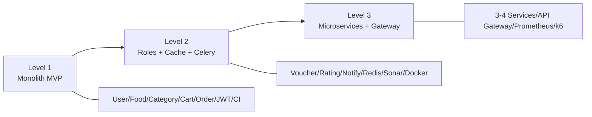

---

## 2. BUSINESS ANALYSIS

### 2.1 Actors

| Actor | Mô tả |
|-------|-------|
| **Customer** | Khách hàng đặt món, thanh toán, đánh giá |
| **Restaurant Manager** | Quản lý menu, đơn hàng cửa hàng, doanh thu |
| **Delivery Staff** | Nhận đơn giao, cập nhật trạng thái giao |
| **Admin** | Quản lý toàn hệ thống, user, voucher |
| **Guest** | Xem menu (chưa đăng nhập) |

### 2.2 Use Cases

| ID | Use Case | Actor |
|----|----------|-------|
| UC-01 | Đăng ký / Đăng nhập | Customer, Admin |
| UC-02 | Xem & tìm kiếm món ăn | Customer, Guest |
| UC-03 | Quản lý giỏ hàng | Customer |
| UC-04 | Đặt hàng & thanh toán | Customer |
| UC-05 | Theo dõi trạng thái đơn | Customer |
| UC-06 | Đánh giá món ăn | Customer |
| UC-07 | CRUD món / danh mục | Restaurant Manager, Admin |
| UC-08 | Quản lý đơn hàng | Restaurant Manager, Delivery Staff |
| UC-09 | Quản lý voucher | Admin |
| UC-10 | Xem báo cáo doanh thu | Restaurant Manager, Admin |
| UC-11 | Quản lý người dùng | Admin |
| UC-12 | Nhận thông báo | Customer, Delivery Staff |

### 2.3 User Stories (Product Backlog)

| ID | User Story | SP | Level | Priority |
|----|------------|-----|-------|----------|
| US-01 | Là Customer, tôi muốn đăng ký/đăng nhập | 5 | L1 | Must |
| US-02 | Là Customer, tôi muốn xem menu theo danh mục | 3 | L1 | Must |
| US-03 | Là Customer, tôi muốn tìm kiếm món theo tên | 3 | L1 | Must |
| US-04 | Là Customer, tôi muốn thêm món vào giỏ hàng | 5 | L1 | Must |
| US-05 | Là Customer, tôi muốn đặt hàng và thanh toán | 8 | L1 | Must |
| US-06 | Là Customer, tôi muốn theo dõi trạng thái đơn | 5 | L1 | Must |
| US-07 | Là Admin, tôi muốn CRUD user/món/danh mục | 8 | L1 | Must |
| US-08 | Là Customer, tôi muốn đánh giá món sau khi nhận hàng | 5 | L2 | Should |
| US-09 | Là Admin, tôi muốn tạo voucher giảm giá | 5 | L2 | Should |
| US-10 | Là Customer, tôi muốn nhận thông báo khi đơn thay đổi trạng thái | 5 | L2 | Should |
| US-11 | Là Restaurant Manager, tôi muốn xem doanh thu theo ngày | 5 | L2 | Should |
| US-12 | Là Delivery Staff, tôi muốn cập nhật trạng thái giao hàng | 5 | L2 | Should |
| US-13 | Tách User/Food/Order service | 13 | L3 | Must |
| US-14 | API Gateway và load test | 8 | L3 | Must |

### 2.4 Use Case Diagram

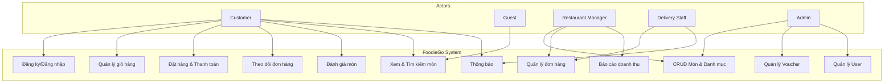

### 2.5 Activity Diagram — Luồng đặt hàng

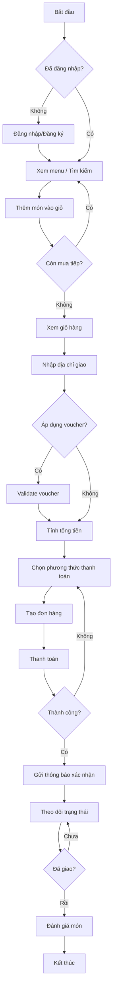

---

## 3. DATABASE DESIGN

### 3.1 ERD

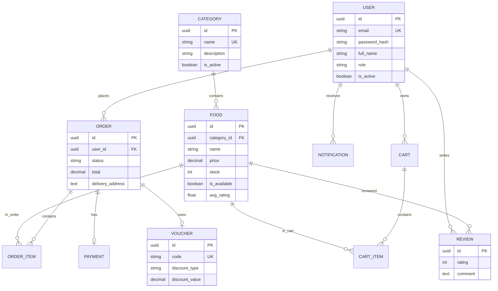

### 3.2 Danh sách bảng

| # | Bảng | Mô tả |
|---|------|-------|
| 1 | `users` | Tài khoản (Custom User) |
| 2 | `categories` | Danh mục món ăn |
| 3 | `foods` | Món ăn |
| 4 | `carts` | Giỏ hàng (1 user = 1 cart) |
| 5 | `cart_items` | Chi tiết giỏ hàng |
| 6 | `orders` | Đơn hàng |
| 7 | `order_items` | Chi tiết đơn hàng |
| 8 | `payments` | Thanh toán |
| 9 | `vouchers` | Mã giảm giá |
| 10 | `reviews` | Đánh giá |
| 11 | `notifications` | Thông báo |

### 3.3 SQL PostgreSQL

Xem file: [`sql/schema.sql`](sql/schema.sql)

---

## 4. ARCHITECTURE

### 4.1 Level 1 — Monolithic

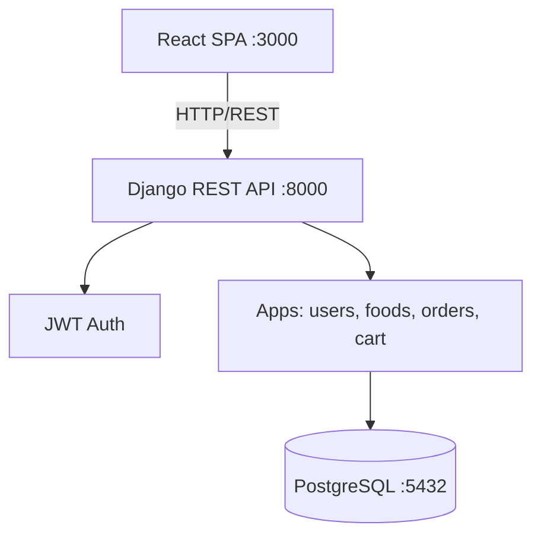

### 4.2 Level 2 — Monolith mở rộng

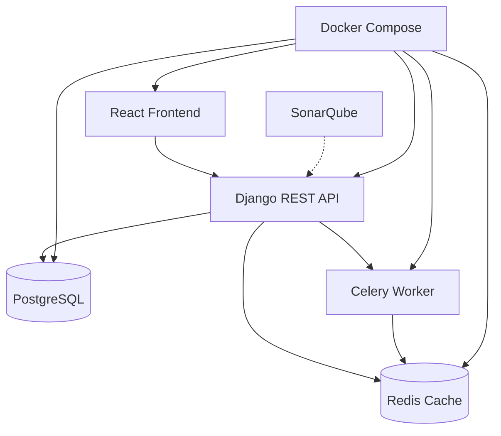

### 4.3 Level 3 — Microservices

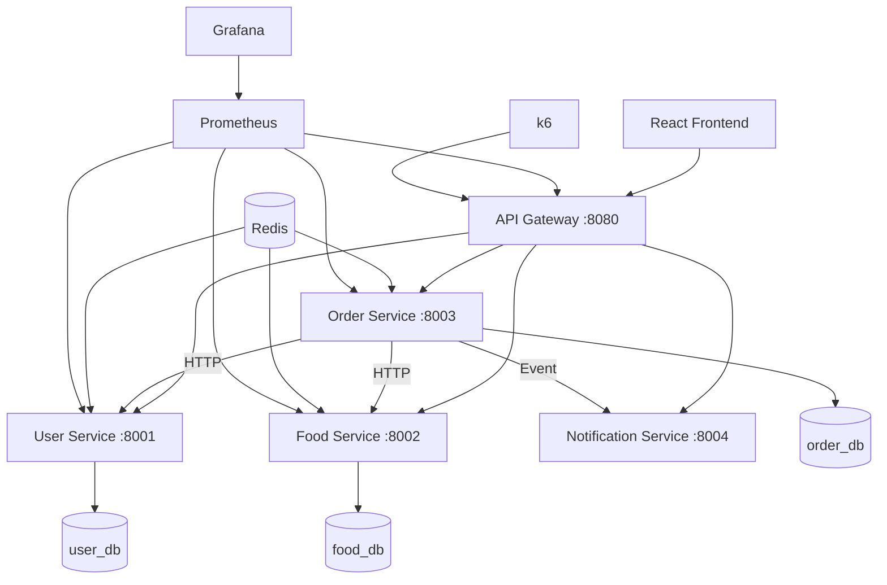

### 4.4 Sequence Diagram — Đặt hàng

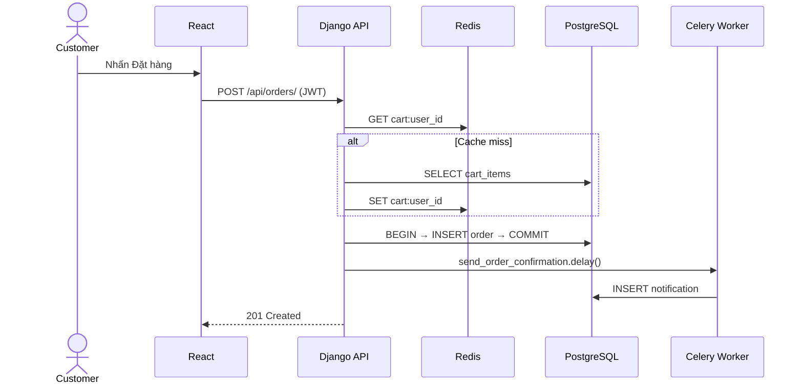

### 4.5 Deployment Diagram

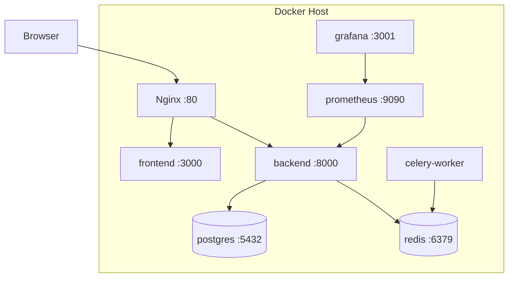

---

## 5. API DESIGN

**Base URL:** `http://localhost:8000/api/v1`  
**Auth:** `Authorization: Bearer <access_token>`  
**Docs:** Swagger tại `/api/docs/` (drf-spectacular)

### 5.1 Authentication

#### POST `/auth/register/`

| | |
|---|---|
| Method | POST |
| Auth | Không |
| Request | `{ "email", "password", "full_name", "phone" }` |
| Response 201 | `{ "id", "email", "full_name", "role" }` |
| Errors | 400 validation, 409 email exists |

```json
{
  "email": "user@example.com",
  "password": "SecurePass123!",
  "full_name": "Nguyen Van A",
  "phone": "0901234567"
}
```

#### POST `/auth/login/`

| | |
|---|---|
| Method | POST |
| Response 200 | `{ "access", "refresh", "user" }` |
| Errors | 401 invalid credentials |

#### POST `/auth/refresh/`

Refresh token → access token mới.

---

### 5.2 Categories

| Endpoint | Method | Auth | Mô tả |
|----------|--------|------|-------|
| `/categories/` | GET | Public | Danh sách |
| `/categories/` | POST | Admin/Manager | Tạo |
| `/categories/{id}/` | GET | Public | Chi tiết |
| `/categories/{id}/` | PUT/PATCH | Admin/Manager | Cập nhật |
| `/categories/{id}/` | DELETE | Admin | Xóa |

---

### 5.3 Foods

| Endpoint | Method | Auth | Mô tả |
|----------|--------|------|-------|
| `/foods/` | GET | Public | List + `?category=&search=&page=` |
| `/foods/` | POST | Admin/Manager | Tạo món |
| `/foods/{id}/` | GET/PUT/PATCH/DELETE | Public / Admin | CRUD |

```json
{
  "count": 12,
  "results": [{
    "id": "uuid",
    "name": "Beef Burger",
    "price": "85000.00",
    "category": { "id": "uuid", "name": "Burger" },
    "is_available": true,
    "avg_rating": 4.5
  }]
}
```

---

### 5.4 Cart

| Endpoint | Method | Auth |
|----------|--------|------|
| `/cart/` | GET | Customer |
| `/cart/items/` | POST | Customer |
| `/cart/items/{id}/` | PATCH/DELETE | Customer |
| `/cart/clear/` | POST | Customer |

---

### 5.5 Orders

| Endpoint | Method | Auth |
|----------|--------|------|
| `/orders/` | GET/POST | Customer |
| `/orders/{id}/` | GET | Owner/Staff |
| `/orders/{id}/status/` | PATCH | Manager/Delivery |

```json
{
  "delivery_address": "123 Nguyen Van Linh, Q7, HCM",
  "payment_method": "cod",
  "voucher_code": "FOODIE10"
}
```

**Status codes:** 201, 400, 401, 404

---

### 5.6 Payments

| Endpoint | Method | Mô tả |
|----------|--------|-------|
| `/payments/{order_id}/` | GET | Trạng thái thanh toán |
| `/payments/{order_id}/confirm/` | POST | Xác nhận mock gateway |

---

### 5.7 Vouchers (Level 2)

| Endpoint | Method | Auth |
|----------|--------|------|
| `/vouchers/` | GET/POST | Admin |
| `/vouchers/validate/` | POST | Customer |

---

### 5.8 Reviews (Level 2)

| Endpoint | Method | Auth |
|----------|--------|------|
| `/reviews/` | GET/POST | Public / Customer |
| `/foods/{id}/reviews/` | GET | Public |

---

### 5.9 Notifications (Level 2)

| Endpoint | Method | Auth |
|----------|--------|------|
| `/notifications/` | GET | Authenticated |
| `/notifications/{id}/read/` | PATCH | Owner |

---

### 5.10 Admin / Reports

| Endpoint | Method | Auth |
|----------|--------|------|
| `/admin/users/` | CRUD | Admin |
| `/reports/revenue/?from=&to=` | GET | Admin/Manager |

---

## 6. FRONTEND STRUCTURE

### 6.1 Cấu trúc thư mục

```
frontend/
├── src/
│   ├── api/              # axiosClient, authApi, foodApi, orderApi
│   ├── components/
│   │   ├── common/       # Button, Input, Loading, Modal
│   │   ├── layout/       # Header, Footer, Sidebar, AdminLayout
│   │   ├── food/         # FoodCard, FoodList, SearchBar
│   │   ├── cart/         # CartItem, CartSummary
│   │   └── order/        # OrderStatus, OrderTimeline
│   ├── contexts/         # AuthContext, CartContext
│   ├── hooks/            # useAuth, useCart
│   ├── pages/
│   │   ├── public/       # Home, Menu, Login, Register
│   │   ├── customer/     # Cart, Checkout, Orders
│   │   └── admin/        # Dashboard, Foods, Orders, Revenue
│   └── routes/           # AppRoutes, ProtectedRoute
├── .eslintrc.cjs
└── Dockerfile
```

### 6.2 Pages

| Page | Route | Role |
|------|-------|------|
| Home | `/` | Public |
| Menu | `/menu` | Public |
| Food Detail | `/foods/:id` | Public |
| Login / Register | `/login`, `/register` | Public |
| Cart / Checkout | `/cart`, `/checkout` | Customer |
| My Orders | `/orders`, `/orders/:id` | Customer |
| Admin Dashboard | `/admin/*` | Admin/Manager |

### 6.3 State Management

| State | Giải pháp |
|-------|-----------|
| Auth | React Context + localStorage |
| Cart | Context hoặc Zustand (L2) |
| Server data | React Query (L2) |
| Form | React Hook Form |

---

## 7. BACKEND STRUCTURE

### 7.1 Cấu trúc Django

```
backend/
├── config/
│   ├── settings/         # base, development, production
│   ├── urls.py
│   ├── celery.py
│   └── wsgi.py
├── apps/
│   ├── users/            # models, serializers, views, permissions, services
│   ├── foods/
│   ├── cart/
│   ├── orders/           # services, tasks (Celery)
│   ├── vouchers/
│   ├── reviews/
│   └── notifications/
├── requirements/
├── pytest.ini
└── Dockerfile
```

### 7.2 Permissions (ví dụ)

```python
class IsAdmin(BasePermission):
    def has_permission(self, request, view):
        return request.user.is_authenticated and request.user.role == 'admin'

class IsRestaurantManager(BasePermission):
    def has_permission(self, request, view):
        return request.user.role in ('admin', 'restaurant_manager')
```

### 7.3 Services Layer (ví dụ)

```python
@transaction.atomic
def create_order_from_cart(user, delivery_address, payment_method, voucher=None):
    cart = Cart.objects.select_for_update().get(user=user)
    items = cart.items.select_related('food').all()
    if not items.exists():
        raise ValueError("Cart is empty")
    subtotal = sum(i.food.price * i.quantity for i in items)
    discount = voucher.calculate_discount(subtotal) if voucher else 0
    order = Order.objects.create(
        user=user, subtotal=subtotal, discount=discount,
        total=subtotal - discount, delivery_address=delivery_address,
        payment_method=payment_method, voucher=voucher
    )
    # ... create order items, update stock, clear cart
    return order
```

---

## 8. SPRINT PLANNING

Chi tiết đầy đủ: [SPRINT-PLANNING.md](SPRINT-PLANNING.md)

| Sprint | Mục tiêu | SP | Deliverables |
|--------|----------|-----|--------------|
| S1 | Setup & Auth | 8 | Repo, JWT, CI skeleton |
| S2 | Menu & Category | 10 | CRUD, search, pytest 50% |
| S3 | Cart & Order | 13 | Cart, checkout, COD |
| S4 | L1 Complete | 10 | Order tracking, coverage 70% |
| S5 | Roles & Voucher | 10 | 4 roles, voucher, revenue |
| S6 | Rating & Docker | 10 | Review, Celery, Redis, Docker |
| S7 | Quality | 8 | Sonar, coverage 80% |
| S8 | Microservices | 13 | 3 services, Gateway, k6 |

---

## 9. DOCKER

Xem file mẫu:

- [`docker/Dockerfile.backend`](docker/Dockerfile.backend)
- [`docker/Dockerfile.frontend`](docker/Dockerfile.frontend)
- [`docker/docker-compose.yml`](docker/docker-compose.yml)

---

## 10. GITHUB ACTIONS

Xem file: [`.github/workflows/ci.yml`](../.github/workflows/ci.yml)

**Jobs:** backend-test → frontend-lint-build → sonarqube → deploy (main only)

---

## 11. SONARQUBE

### Quality Gate

| Metric | Ngưỡng |
|--------|--------|
| Coverage | ≥ 80% on new code |
| Bugs | 0 |
| Vulnerabilities | 0 |
| Code Smells | ≤ 10 |
| Duplicated Lines | ≤ 3% |

Xem cấu hình: [`sonar-project.properties`](../sonar-project.properties)

---

## 12. REDIS + CELERY

### Cache Keys

| Key Pattern | TTL | Dữ liệu |
|-------------|-----|---------|
| `foods:list:{page}:{hash}` | 5 phút | Danh sách món |
| `foods:detail:{id}` | 10 phút | Chi tiết món |
| `categories:all` | 30 phút | Danh mục |
| `cart:{user_id}` | 1 giờ | Giỏ hàng |

### Background Jobs

| Task | Trigger |
|------|---------|
| `send_order_confirmation` | Order created |
| `send_status_update` | Status changed |
| `calculate_daily_revenue` | Cron 00:00 |
| `expire_vouchers` | Cron hourly |
| `update_food_avg_rating` | Review created |

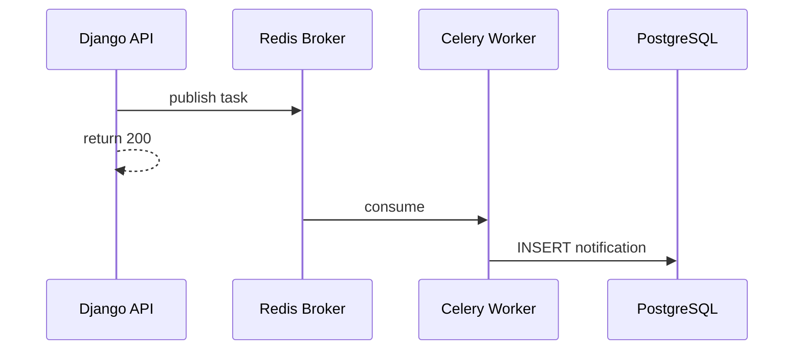

---

## 13. PROMETHEUS + GRAFANA

### Metrics

| Metric | Loại | Mô tả |
|--------|------|-------|
| `http_requests_total` | Counter | Request theo endpoint, status |
| `http_request_duration_seconds` | Histogram | Latency P50/P95/P99 |
| `celery_task_total` | Counter | Task success/failure |
| `redis_cache_hits_total` | Counter | Cache hit/miss |
| `orders_created_total` | Counter | Business metric |

### Grafana Dashboard Panels

1. Overview: RPS, error rate, avg latency
2. API: Top 10 slowest endpoints
3. Celery: Queue length, failure rate
4. Business: Orders/hour, revenue today

---

## 14. k6 LOAD TEST

Xem script: [`tests/load/script.js`](../tests/load/script.js)

### KPI

| KPI | Target |
|-----|--------|
| P95 GET /foods/ | < 500ms |
| P95 POST /orders/ | < 1500ms |
| Error rate | < 1% |
| Throughput | ≥ 100 RPS (read) |

Chạy: `k6 run tests/load/script.js`

---

## 15. SPQM REPORT

Chi tiết đầy đủ: [SPQM-REPORT.md](SPQM-REPORT.md)

Bao gồm: SDLC, ETVX, SMART-Q, PDCA, Metrics, CMMI, Retrospective, ODA

---

## 16. TIMELINE 4 TUẦN

> Chi tiết task + branch: [FOODIEGO-MASTER-TASKS.md](FOODIEGO-MASTER-TASKS.md)

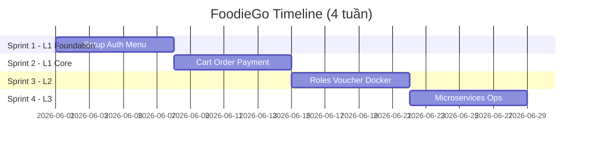

| Tuần | Sprint | Milestone |
|------|--------|-----------|
| 1 | S1 | Auth + Menu + Swagger |
| 2 | S2 | **Level 1** — Cart, Order, Coverage 70% |
| 3 | S3 | **Level 2** — Voucher, Docker, Sonar 80% |
| 4 | S4 | **Level 3** — Microservices + nộp đồ án |

---

## 17. CHECKLIST HOÀN THÀNH

Theo dõi chi tiết: [CHECKLIST-TIEN-DO.md](CHECKLIST-TIEN-DO.md)

---

## 18. DANH SÁCH FILE NỘP

```
FoodieGo-Submission/
├── 01_Report/
│   ├── BaoCaoDoAn_FoodieGo.pdf
│   ├── SPQM_Report.pdf
│   └── Slide_ThuyetTrinh.pptx
├── 02_Design/
│   ├── UseCase_Diagram.png
│   ├── ERD.png
│   ├── Architecture_L1_L2_L3.pdf
│   └── API_Specification.pdf
├── 03_SourceCode/
│   ├── backend/
│   ├── frontend/
│   └── docker-compose.yml
├── 04_Testing/
│   ├── pytest_coverage_report.html
│   ├── sonarqube_report.pdf
│   └── k6_load_test_report.html
├── 05_SPQM_Evidence/
│   ├── Product_Backlog.xlsx
│   ├── Metrics_Trend.xlsx
│   └── Retrospective_Notes.pdf
└── 06_Demo/
    └── demo_video.mp4
```

---

## GỢI Ý CHO SINH VIÊN NĂM 2

1. **Tuần 1–4:** Hoàn thiện Level 1 trước — đừng nhảy microservices sớm
2. **Team 3–4 người:** 1 BE lead, 1 FE lead, 1 QA/DevOps, 1 full-stack
3. **Seed data:** 20 món, 5 category, 4 user mỗi role
4. **Thanh toán:** Mock COD — tránh VNPay sớm
5. **Microservices:** Tách service layer trong monolith trước, rồi mới tách container
6. **SPQM:** Ghi metrics **mỗi sprint** — không đợi cuối kỳ
