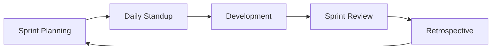
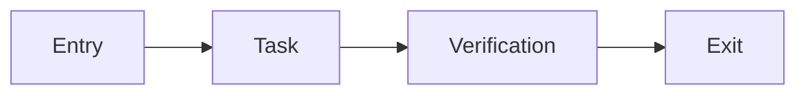

# SPQM Report — FoodieGo

Báo cáo Quản lý Chất lượng Phần mềm (Software Project Quality Management)

---

## 1. SDLC — Scrum (Hybrid)

### Lý do chọn Scrum

| Tiêu chí | Scrum phù hợp vì |
|----------|-------------------|
| Thời gian | 8 tuần = 8 Sprint, demo hàng tuần |
| Yêu cầu | Level 1→2→3 thay đổi dần, backlog linh hoạt |
| Team | 3–4 SV, roles rõ (BE, FE, QA, SM) |
| SPQM | Sprint Review + Retrospective = PDCA tự nhiên |

### Vòng đời Sprint



| Phase | Hoạt động | Output |
|-------|-----------|--------|
| Planning | Chọn story từ Product Backlog | Sprint Backlog |
| Execution | Code, test, PR, review | Increment |
| Review | Demo cho GV / team | Feedback |
| Retrospective | Cải tiến quy trình | Action items |

---

## 2. ETVX — Quy trình Implement User Story

### Sơ đồ



### Chi tiết

| Phase | Mô tả | Tiêu chí |
|-------|-------|----------|
| **Entry** | Story approved, DoR đạt | Có AC, API spec/mockup, branch `feature/FOOD-xxx` tạo |
| **Task** | Implement BE+FE, unit test, self-review, tạo PR | Code + test local pass |
| **Verification** | Code review, CI pass, QA test theo AC | ≥1 reviewer approve, coverage không giảm |
| **Exit** | Merge develop, cập nhật docs | Story Done, Swagger cập nhật |

### Vai trò trong ETVX

| Vai trò | Entry | Task | Verification | Exit |
|---------|-------|------|--------------|------|
| **Scrum Master** | Facilitate planning | Remove blocker | Đảm bảo review đúng hạn | Track burndown |
| **Backend Dev** | Confirm API spec | Models, serializers, services, pytest | Fix review comments | Merge + migrate docs |
| **Frontend Dev** | Confirm UI mockup | Pages, components, API integration | ESLint pass | Demo UI |
| **QA** | Review AC | Viết test case | Manual + regression test | Sign-off Done |

---

## 3. Product Vision

> **FoodieGo** giúp khách hàng đặt món nhanh, theo dõi giao hàng realtime, và giúp nhà hàng quản lý menu — doanh thu — voucher trên một nền tảng web hiện đại, có CI/CD và chất lượng code được đo lường.

---

## 4. SMART-Q Goals

| ID | Sprint | Goal |
|----|--------|------|
| SQ-1 | S4 | **S**pecific: Coverage ≥70%. **M**easurable: pytest-cov report. **A**chievable: 3 dev. **R**elevant: Level 1 req. **Q**uality: 0 critical bugs, CI 100% pass |
| SQ-2 | S7 | Coverage ≥80%, Sonar 0 bugs/vulnerabilities, Docker Compose 1 lệnh |
| SQ-3 | S8 | 3 microservices deploy OK, k6 P95 <500ms (GET /foods/), Quality Gate pass CI |

---

## 5. Low Hanging Fruit

1. Django Admin — seed data nhanh
2. Fixture JSON — 20 món, 5 category
3. drf-spectacular — Swagger tự động
4. GitHub Actions template có sẵn
5. Pre-commit (black, isort, eslint)
6. Mock payment COD — không VNPay sớm

---

## 6. Quản lý thay đổi

### Git Flow

```
main (production)
  └── develop (integration)
        ├── feature/FOOD-001-user-auth
        ├── feature/FOOD-012-cart-api
        └── bugfix/FOOD-045-order-status
```

### Branch Strategy

| Branch | Mục đích | Merge vào |
|--------|----------|-----------|
| `main` | Production-ready | — |
| `develop` | Integration | `main` (release) |
| `feature/*` | User story mới | `develop` |
| `bugfix/*` | Sửa lỗi | `develop` |
| `hotfix/*` | Sửa khẩn production | `main` + `develop` |

### Commit Convention (Conventional Commits)

```
feat(cart): add item to cart API
fix(order): validate stock before checkout
test(food): add unit tests for search filter
docs(api): update swagger for voucher endpoints
ci(github): add sonarqube scan step
```

### Pull Request Template

Lưu tại `.github/pull_request_template.md`:

```markdown
## Description
<!-- Mô tả thay đổi -->

## Related Issue
Closes #

## Checklist
- [ ] Tests added/updated
- [ ] Coverage không giảm
- [ ] ESLint pass
- [ ] API docs updated
- [ ] Self-reviewed
```

### Code Review Checklist

- [ ] Logic đúng business rules
- [ ] Không hard-code secret
- [ ] Permission/authorization đúng role
- [ ] Error handling + status code chuẩn
- [ ] Không N+1 query
- [ ] Test cover happy path + edge case

---

## 7. PDCA — Cải tiến quy trình

### Vấn đề (Sprint 3)

PR merge chậm, CI fail rate ~40% do dev không chạy test local trước khi push.

### PDCA Cycle

| Phase | Hành động | Kết quả |
|-------|-----------|---------|
| **Plan** | Thêm pre-commit hooks; rule: không review nếu CI đỏ | — |
| **Do** | Cài pre-commit (black, pytest quick, eslint); training 30 phút | Sprint 4 |
| **Check** | CI fail 40% → 12%; Lead time 2.5 ngày → 1.2 ngày | Đo bằng GitHub Actions |
| **Act** | Ghi vào CONTRIBUTING.md; bắt buộc cho member mới | Sprint 5+ |

---

## 8. Metrics — Baseline & Trend

### Bảng metrics

| Metric | Baseline (S2) | Target (S8) | Công cụ |
|--------|---------------|-------------|---------|
| Test Coverage | 45% | ≥80% | pytest-cov |
| Sonar Bugs | 8 | 0 | SonarQube |
| Vulnerabilities | 3 | 0 | SonarQube |
| Code Smells | 45 | ≤10 | SonarQube |
| Lead Time (commit→merge) | 2.5 ngày | ≤1 ngày | GitHub Insights |
| CI Fail Rate | 40% | ≤10% | GitHub Actions |
| API P95 (GET /foods/) | 800ms | ≤500ms | Prometheus / k6 |
| Error Rate | 3% | ≤1% | Grafana |

### Template ghi trend (điền mỗi Sprint)

| Sprint | Coverage | Sonar Bugs | CI Fail % | Lead Time | P95 API |
|--------|----------|------------|-----------|-----------|---------|
| S1 | | | | | |
| S2 | 45% | 8 | 40% | 2.5d | 800ms |
| S3 | | | | | |
| S4 | 70% | | | | |
| S5 | | | | | |
| S6 | | | | | |
| S7 | 80% | 0 | 12% | 1.2d | |
| S8 | | 0 | ≤10% | ≤1d | ≤500ms |

---

## 9. CMMI Level 1 → 3

| Level | Hiện trạng | Bằng chứng | Điểm mạnh | Điểm yếu | Gap | Kế hoạch nâng cấp |
|-------|------------|------------|-----------|----------|-----|-------------------|
| **L1 Initial** | S1–2: ad-hoc | Commit không chuẩn | Nhanh có MVP | Không repeatable | Thiếu quy trình | Git Flow + CI |
| **L2 Managed** | S3–6: có plan | Sprint backlog, CI, coverage | Planned, tracked | Retrospective không đều | Metrics chưa đủ | PDCA mỗi sprint |
| **L3 Defined** | S7–8: chuẩn hóa | ETVX, PR template, Quality Gate | Process defined | Microservices phức tạp | Training team | CONTRIBUTING.md |

---

## 10. Sprint Retrospective (mẫu Sprint 6)

| | Nội dung |
|---|----------|
| **What went well** | Docker Compose chạy ổn; Celery notification hoạt động |
| **What didn't** | Redis cache invalidation bug; thiếu integration test |
| **Action items** | (1) Integration test orders (2) Document cache keys (3) Pair review Celery |
| **Owner** | Backend + QA |
| **Due** | Sprint 7 |

---

## 11. ODA — Tổng kết

| Dimension | Đánh giá |
|-----------|----------|
| **Outcome** | Hệ thống FoodieGo 3 level, deploy được, demo đủ UC |
| **Delivery** | 8/8 sprint, ~82 SP |
| **Achievement** | Coverage 80%+, Quality Gate pass, k6 KPI đạt |
| **Lessons** | Monolith trước microservices; metrics sớm; pre-commit tiết kiệm thời gian |
| **Next steps** | Payment gateway thật, WebSocket tracking, Kubernetes |

---

## 12. Danh sách file SPQM cần nộp

- [ ] `SPQM_Report.pdf` (export file này)
- [ ] `Product_Backlog.xlsx`
- [ ] `Sprint_Backlog_S1-S8.xlsx`
- [ ] `Metrics_Trend.xlsx`
- [ ] `PDCA_Improvement.pdf`
- [ ] `CMMI_Assessment.pdf`
- [ ] `Retrospective_Notes.pdf`
- [ ] Screenshot 3–5 PR đã review
- [ ] GitHub Actions logs
